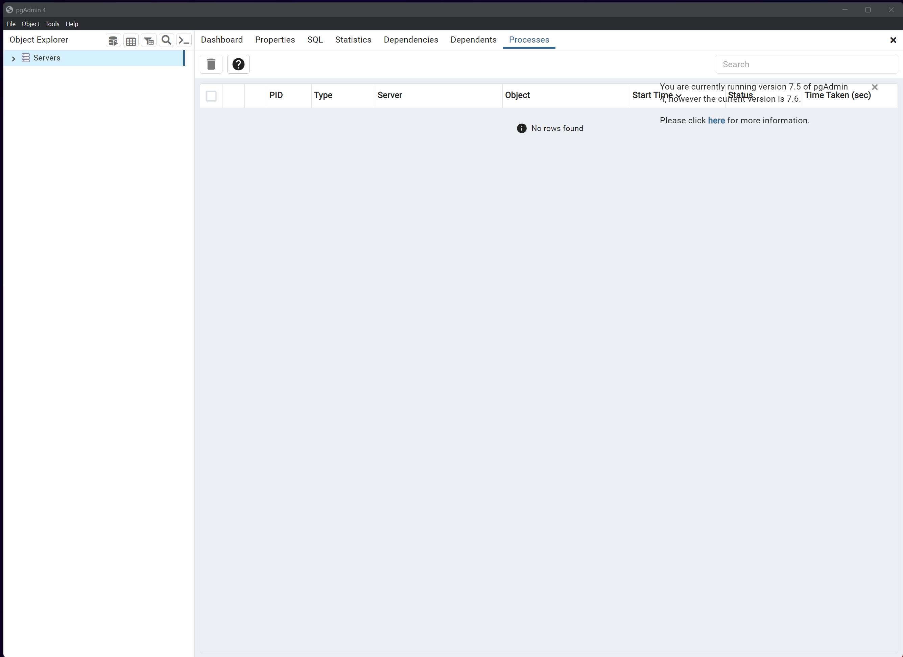
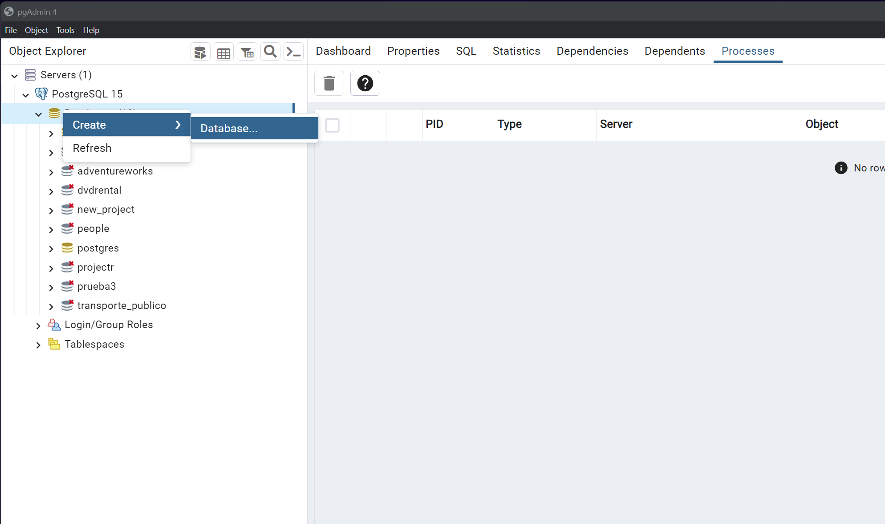
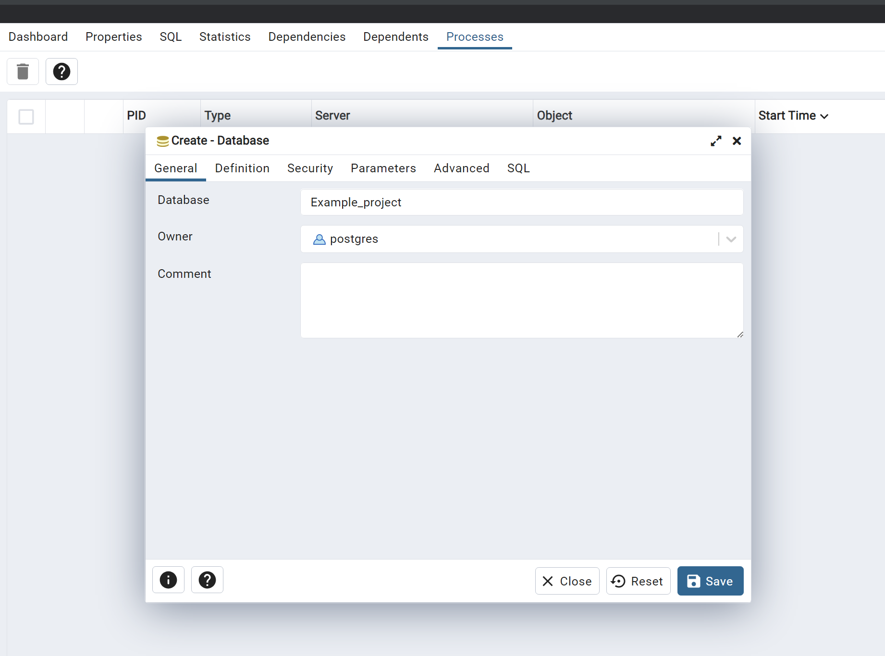
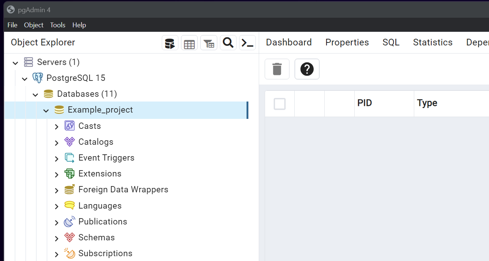
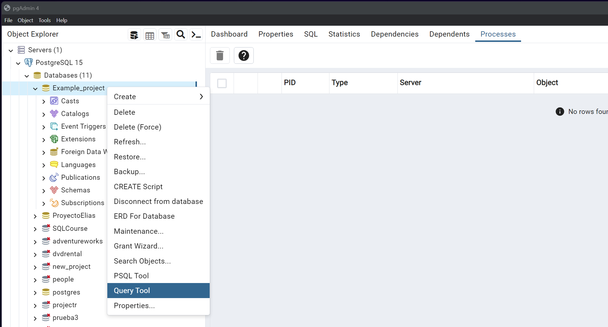
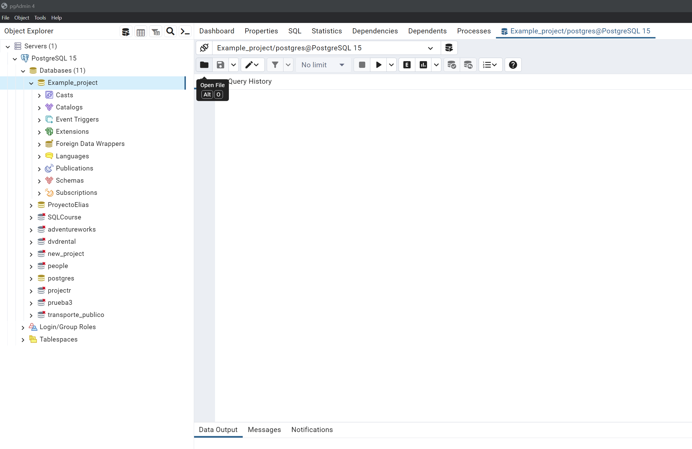
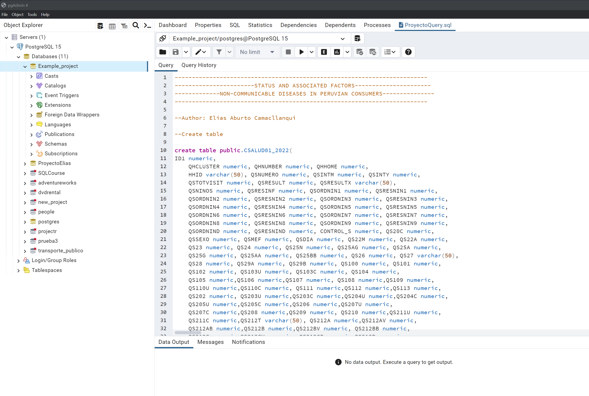
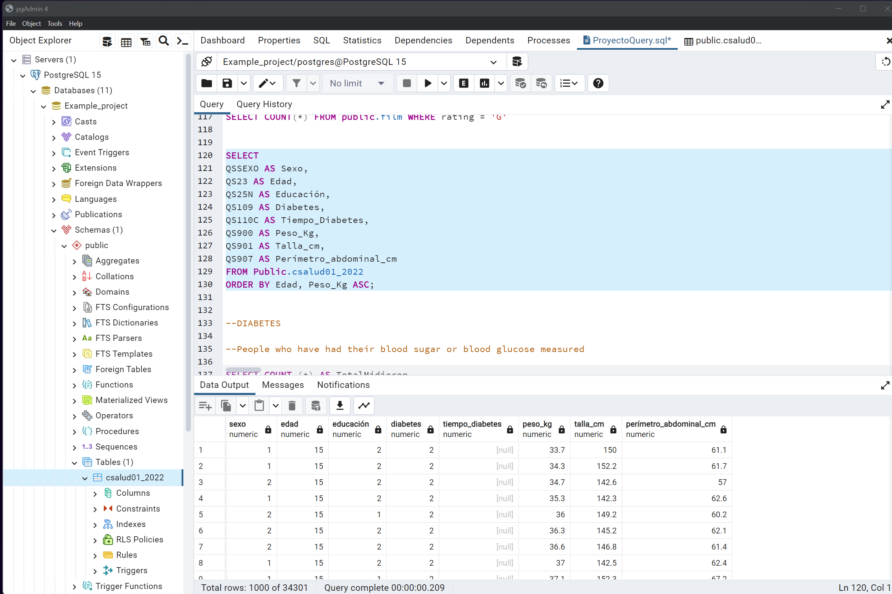

# Introduction

<!-- Adjust size using width and height attributes -->

Non-communicable diseases are the leading causes of death worldwide. Efforts are being made to understand the factors associated with these diseases with the aim of proposing effective public policies that contribute to their reduction.

# Methodology

**Problem:** What is the status and factors associated with non-communicable diseases in Peruvian consumers?

**Objective:** To characterize the status and factors associated with non-communicable diseases in Peruvian consumers.

**Target population:** People over 15 years of age.

**Data Base:** INEI, Endes 2022

**Measurement:** Health and Household Questionnaire

**Data preprocessing:**

- 1. Download modules 1640 and 1629 of the Demographic and Family Health Survey in csv format.

- 2. Change commas to dots in the CSALUD01 and RECH0 DBs. SQL considers the dots as referring to decimals, the comma interprets it as a strange character. When you download the INEI database, the decimals are separated by commas. Modify it with notepad or another tool.

# Results

**1. Open pgAdmin 4**

<!-- Adjust size using width and height attributes -->

  

**2. Create a new database**

<!-- Adjust size using width and height attributes -->

  

**3. Name the project and save.**

<!-- Adjust size using width and height attributes -->

  

**4. We will have the database created.**

<!-- Adjust size using width and height attributes -->

  

**5. We will open a Query Tool**

<!-- Adjust size using width and height attributes -->

  

**6. Now we will open the attached file**

<!-- Adjust size using width and height attributes -->

  

**7. You can see the document ProyectoQuery.sql**

<!-- Adjust size using width and height attributes -->

  

**8. Now we can read the data in postgreSQL**

<!-- Adjust size using width and height attributes -->

  

# Conclusion

It is possible to analyze INEI databases using PostgreSQL.

